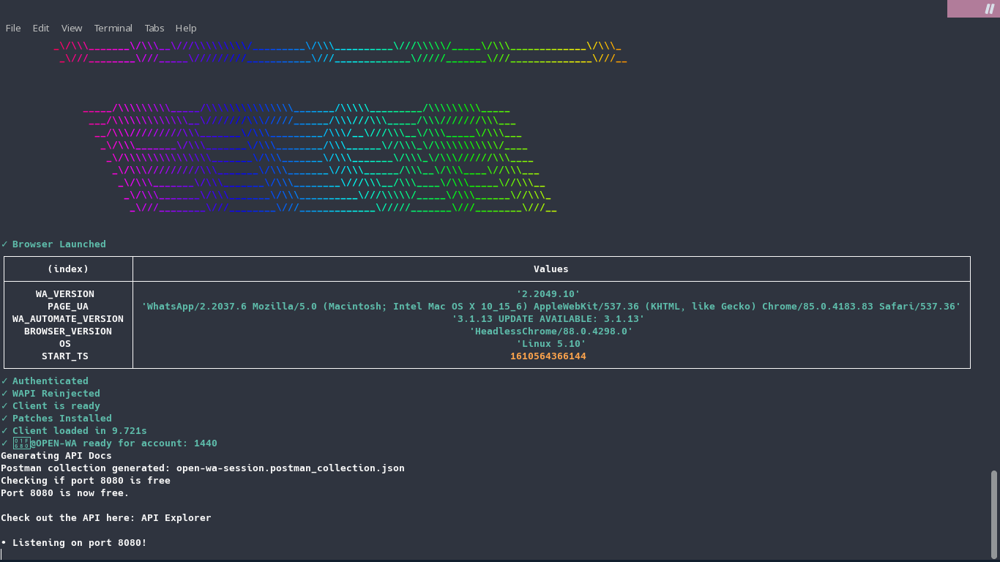
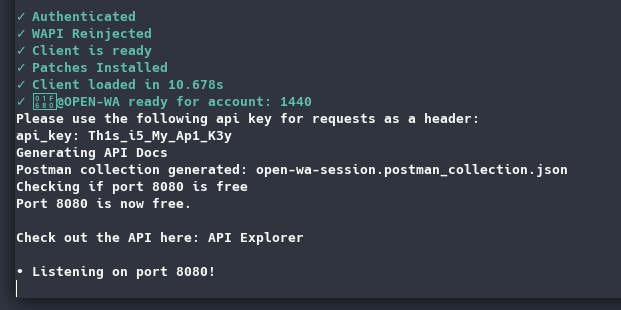

# Easy API

### Quick API

Wanted to create an API out of your WA number? You're in luck!

#### Basic usage

> npx @open-wa/wa-automate -p &lt;listen port&gt;



```bash
npx @open-wa/wa-automate -p 8080
```





#### How I Can Protect My API?

@open-wa/wa-automate is support API with an api key, so don't worry about your API. Here's usage

> npx @open-wa/wa-automate -p &lt;listen port&gt; -k &lt;api key&gt;



```bash
npx @open-wa/wa-automate -p 8080 -k "Th1s_i5_My_Ap1_K3y"
```





### Running on a Server

